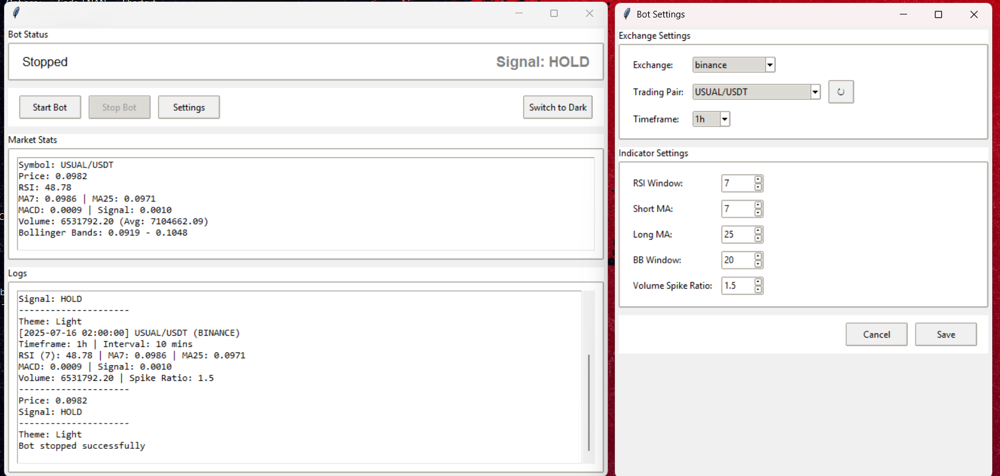
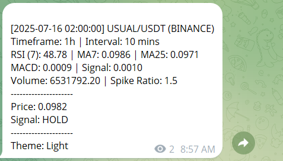

# 🚀 CreepyBot - Cryptocurrency Trading Bot

## 😁 This is a fun project only 😁




## 🔧 Features

- Real-time price monitoring
- Technical indicators:
  - RSI
  - MACD
  - Bollinger Bands
- Multi-exchange support:
  - Binance
  - Coinbase Pro
- Home page ui + settings ui
  - sections
    - Market Stats
    - Logs
    - Bot status
- Telegram Notification send through telegram bot

### Prerequisites

- Python 3.8+
- [Telegram Bot Token](https://core.telegram.org/bots#create-a-new-bot)

### 1. Clone Repository

```bash
git clone https://github.com/MRIEnan/creepyBot.git
cd creepybot
```

## 📦 Installation

### Environment Setup [Optional]

```bash
python -m venv newvenv [optional][ please try to keep the name "newvenv" as given if want to work within an environment]

source newenv/bin/activate  # Linux/Mac
or
newenv\Scripts\Activate.ps1    # Windows
```

### module installation

```bash
pip install -r requirements.txt
```

## 🕹️ Configuration

create a file name <b>config.csv</b>

```csv
TELEGRAM_TOKEN,<value>,
TELEGRAM_CHAT_ID,<value>,
SYMBOL,<value>,
TIMEFRAME,<value>,
INTERVAL,<value>,
RSI_WINDOW,<value>,
SMA_SHORT,<value>,
SMA_LONG,<value>,
BB_WINDOW,<value>,
VOLUME_SPIKE_RATIO,<value>,
EXCHANGE,<value>,
THEME,<value>,
```

### example data

```csv
TELEGRAM_TOKEN,<value>
TELEGRAM_CHAT_ID,<value>
SYMBOL,UTK/USDT
TIMEFRAME,1h
INTERVAL,10
RSI_WINDOW,7
SMA_SHORT,7
SMA_LONG,25
BB_WINDOW,20
VOLUME_SPIKE_RATIO,1.5
EXCHANGE,binance
THEME,light
```

### Then run the project with

```cmd
python main.py
```

## SUMMARY OF THE PROCESS

The realtime data of the particular coin pair is fetched from the determined source from the settings of ui. Then we do some calculation based on the Moving Average (MA), RSI relative stress index, macd etc.

## Conclusion

<span><small>This project is only for educational purpose. And the calculated signal is not precise. So do not follow the signal seriously. And if anyone use this and the signal not matched with the actual status, I means we will not take any credit.</small></br>
<b style="font-size:18px;color:red">SO USE THIS AT YOUR OWN RISK</b> <span>
